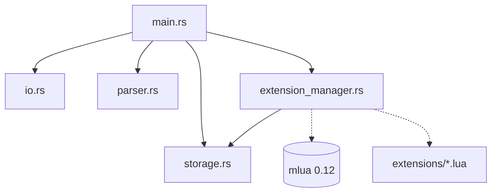

# Banco de Dados Chave-Valor em Memória (Rust + Lua)

## Integrantes do Grupo
- Gabriel Frasão (e integrantes: [Nome Completo dos Integrantes])

---

## 1. Visão Geral

Este projeto consiste em um banco de dados chave-valor em memória desenvolvido em **Rust**, estendido dinamicamente por meio da máquina virtual **Lua 5.4** através da biblioteca [`mlua`](https://crates.io/crates/mlua).

O motor em Rust é totalmente agnóstico a regras de negócio específicas: ele desconhece nomes e prefixos como `cpf_`, `data_` ou qualquer outro. Todas as validações de dados na escrita (`ADD`), formatações na leitura (`GET`) e consultas de integridade durante a validação são gerenciadas por extensões escritas em arquivos `.lua` contidos no diretório `extensions/`, carregadas dinamicamente na inicialização sem necessidade de recompilação.

---

## 2. Como Compilar e Executar

### Requisitos
- [Rust](https://www.rust-lang.org/) (versão 1.85+ ou edição 2024 recomendada). O projeto não requer nenhuma dependência externa do sistema além do compilador e do gerenciador de pacotes Cargo (a biblioteca Lua 5.4 é compilada automaticamente de forma embutida via *feature* `vendored`).

### Compilação
Na raiz do repositório, execute:
```bash
cargo build --release
```
O executável otimizado será gerado em `./target/release/mini-kv-storage`.

### Execução Interativa
Para abrir a interface de terminal interativo própria:
```bash
cargo run --release
```
Ou executando diretamente o binário compilado:
```bash
./target/release/mini-kv-storage
```

**Exemplo de uso interativo:**
```text
$ ./target/release/mini-kv-storage
> ADD cpf_zezinho 12345678909
OK
> GET cpf_zezinho
123.456.789-09
> GET chave_inexistente
ERRO: chave inexistente
> EXIT
$
```

### Execução via *Pipe* (Roteiros Automatizados)
O programa detecta automaticamente se a entrada provém de um terminal interativo ou de um redirecionamento/*pipe*. Quando executado via *pipe*, o prompt `> ` é omitido, mas todas as respostas (`OK`, valores consultados e mensagens `ERRO: ...`) são emitidas exatamente em uma linha na saída padrão (`stdout`), encerrando o processo ao atingir o fim do arquivo (EOF):
```bash
cat roteiro.txt | ./target/release/mini-kv-storage
```

### Execução dos Testes Automatizados
Para rodar a suíte de testes unitários do motor Rust:
```bash
cargo test
```

---

## 3. Protocolo de Registro de Extensões

O sistema adota o padrão de **auto-registro e descoberta em tempo de execução**:
- Durante a inicialização, o [`ExtensionManager`](src/extension_manager.rs) varre o diretório `extensions/` e carrega todo arquivo com terminação `.lua`.
- Cada arquivo `.lua` deve retornar uma tabela contendo as seguintes definições:

```lua
return {
    -- Prefixo de chave que esta extensão intercepta
    prefix = "meuprefixo_",

    -- Hook executado antes da gravação no banco (opcional)
    pre_hook = function(ctx)
        -- Validação ou transformação prévia
    end,

    -- Hook executado após a recuperação do banco (opcional)
    post_hook = function(ctx)
        -- Formatação ou transformação posterior
    end,
}
```

### O Objeto de Contexto (`ctx`)
Tanto `pre_hook` quanto `post_hook` recebem um objeto de contexto (`ctx`), que é uma tabela Lua com os seguintes campos e métodos:

| Campo / Método | Tipo | Descrição |
|---|---|---|
| `ctx.command` | `string` | Nome do comando em execução (`"ADD"` ou `"GET"`). |
| `ctx.key` | `string` | Chave fornecida na operação. |
| `ctx.value` | `string` | Valor passado para gravação (presente no `ADD`). Pode ser alterado pela extensão. |
| `ctx.result` | `string` | Valor retornado do banco (presente no `GET`). Pode ser alterado pela extensão. |
| `ctx.get(key)` | `function` | **Consulta por chave**: consulta o banco em tempo real e retorna o valor de `key` (ou `nil` se não existir). |
| `ctx.get_key_by_value(val)` | `function` | **Consulta reversa $O(1)$**: consulta o banco em tempo real e retorna a chave que contém o valor `val` (ou `nil` se não existir). |

### O que o Motor Rust espera de volta
1. **Em caso de Sucesso**:
   - No `pre_hook`: O motor lê `ctx.value`. Se a extensão alterou esse campo (ex.: normalizou centavos ou formatou dados), o novo valor é o que será efetivamente persistido no banco.
   - No `post_hook`: O motor lê `ctx.result`. Se alterado pela extensão, o novo valor é o que será exibido para o usuário na tela.
2. **Em caso de Erro**:
   - Se os dados forem inválidos ou uma restrição de negócio for violada, a extensão deve invocar `error("motivo")`.
   - O motor Rust intercepta a exceção do Lua, higieniza o rastro de pilha e exibe na tela uma única linha no formato `ERRO: {motivo}`. A operação é abortada e nada é alterado no banco de dados.

---

## 4. Guia Passo a Passo: Como Adicionar uma Nova Extensão

Qualquer pessoa pode adicionar uma nova extensão seguindo este roteiro, **sem tocar em nenhuma linha de código Rust e sem recompilar o projeto**:

1. Navegue até o diretório `extensions/`.
2. Crie um novo arquivo com extensão `.lua` (ex.: `extensions/temperatura.lua`).
3. Defina o prefixo e as operações desejadas retornando a tabela de configuração:
   ```lua
   -- extensions/temperatura.lua
   return {
       prefix = "temp_",

       pre_hook = function(ctx)
           if ctx.command == "ADD" then
               local num = tonumber(ctx.value)
               if not num or num < -273.15 then
                   error("temperatura em Celsius inválida (deve ser >= -273.15)")
               end
           end
       end,

       post_hook = function(ctx)
           if ctx.command == "GET" and ctx.result then
               local c = tonumber(ctx.result)
               local f = (c * 9 / 5) + 32
               ctx.result = string.format("%.1f °C (%.1f °F)", c, f)
           end
       end,
   }
   ```
4. Salve o arquivo.
5. Inicie o banco de dados (`./target/release/mini-kv-storage`). A nova extensão será automaticamente detectada e ativada no boot.

---

## 5. Estruturas de Retorno e Tratamento de Erros no Rust

### Estrutura de Comunicação e Conversão
- **Retorno de transformações**: Os campos `ctx.value` e `ctx.result` são lidos pelo Rust usando `ctx.get::<Option<String>>("value")` e `ctx.get::<Option<String>>("result")`. Caso o script Lua atribua tipos incompatíveis, o Rust utiliza fallbacks seguros (`unwrap_or_else`), impedindo travamentos ou panics.
- **Tratamento de Exceções do Lua**: Quando um script chama `error("mensagem")`, a biblioteca `mlua` retorna um `mlua::Error::RuntimeError(String)`.
- **Higienização de Stack Trace**: A função interna [`clean_lua_error`](src/extension_manager.rs) extrai apenas a mensagem de erro emitida pelo programador, descartando prefixos de arquivos e o traceback de chamadas (`stack traceback:`).
- **Interface de Saída**: O módulo [`io.rs`](src/io.rs) recebe a string e garante que ela seja impressa iniciando com `ERRO: ` no `stdout`.

---

## 6. Extensão Proposta de Tema Livre: Valores Monetários (`moeda.lua`)

Além das extensões obrigatórias de CPF e Data, foi implementada a extensão [`extensions/moeda.lua`](extensions/moeda.lua) para o prefixo `moeda_`.

### O que ela faz
- **No `ADD`**: Valida valores monetários em formato decimal positivo com até duas casas decimais (ex.: `1250.50`, `99.9`, `100`). Rejeita números negativos, mais de duas casas decimais, vírgulas decimais e caracteres alfanuméricos.
- **Normalização na Gravação**: Converte o valor monetário diretamente para **centavos inteiros** antes de persistir no banco (ex.: `"2500.50"` é armazenado internamente como `"250050"`). Trata-se de uma prática padrão em sistemas financeiros para evitar erros de arredondamento inerentes a números de ponto flutuante.
- **No `GET`**: Lê os centavos inteiros armazenados e formata no padrão monetário brasileiro `R$ X.XXX,XX`, incluindo o algoritmo de pontuação de agrupamento de milhares da direita para a esquerda (ex.: `"123456789"` é formatado para `"R$ 1.234.567,89"`).

### O que ela exercita de novo (Diferencial)
- Não se trata de uma simples validação documental como CPF/CNPJ/RG.
- Exercita **transformação ativa com normalização de unidade** no `ADD` (reais com ponto flutuante para centavos inteiros) e **algoritmo de agrupamento de milhares** no `GET`, mecânicas que nem a extensão de CPF nem a de Data executam.
- Os casos de teste completos correspondentes estão versionados no arquivo [`casos_teste_moeda.txt`](casos_teste_moeda.txt).

---

## 7. Consulta ao Banco a partir da Extensão e Resolução de Concorrência no `ADD`

### O Desafio Proposto
O enunciado destaca o seguinte desafio:
> *"No instante em que a extensão faz a pergunta, o comando ADD já está no meio de uma operação sobre esse mesmo banco. Resolver isso é parte do exercício."*

Em Rust, o compilador impõe regras estritas de posse e empréstimo (*aliasing XOR mutability*): não é permitido emprestar uma estrutura como mutável (`&mut Storage`) ao mesmo tempo em que referências compartilhadas (`&Storage`) tentam lê-la, o que causaria erro de compilação ou, no caso de bloqueios primitivos (`Mutex`), *deadlocks* em tempo de execução.

### Como Resolvemos
A solução adotada baseia-se em dois pilares fundamentais:

1. **Compartilhamento com Contagem de Referências e Empréstimo Interior**:
   - A instância única do [`Storage`](src/storage.rs) é envolvida em um `Rc<RefCell<Storage>>`.
   - Isso permite que o motor Rust e as funções de callback registradas no Lua compartilhem o acesso ao mesmo banco em memória sem copiar toda a base de dados.
2. **Separação Rígida de Fases (Validação $\rightarrow$ Mutação)**:
   - **Fase 1 (Validação e Consulta - `trigger_pre_hook`)**: O comando `ADD` é recebido, mas o dado **ainda não foi gravado**. O `ExtensionManager` cria o contexto Lua injetando funções que utilizam empréstimo compartilhado/leitura (`storage.borrow()`). Quando a extensão de CPF invoca `ctx.get_key_by_value(ctx.value)`, ela consulta o banco sob demanda no estado imediatamente anterior à inserção.
   - **Fase 2 (Mutação - `storage.borrow_mut().add(key, value)`)**: Apenas e tão somente se a extensão concluir a validação sem erros, o empréstimo de leitura é finalizado e o motor Rust adquire o empréstimo mutável exclusivo (`borrow_mut()`), persistindo os dados.
   - Se a validação do Lua falhar (por CPF repetido ou dígito inválido), a Fase 2 nunca é executada, garantindo integridade transacional sem *deadlocks* e sem violar o modelo de segurança de memória do Rust.

### Busca Reversa em $O(1)$
Para garantir que a consulta por valor exigida pela unicidade de CPF não degradar para $O(n)$ com o crescimento do banco, o [`Storage`](src/storage.rs) foi projetado com um índice invertido (*multimap*):
```rust
pub struct Storage {
    data: HashMap<String, String>,                     // chave -> valor (O(1))
    value_to_keys: HashMap<String, HashSet<String>>,   // valor -> conjunto de chaves (O(1))
}
```
Isso viabiliza a busca instantânea da chave detentora de um valor no método `get_key_by_value`, permitindo que múltiplos registros compartilhem valores comuns (ex.: datas idênticas) mantendo a verificação de unicidade em tempo constante.

---

## 8. Módulos do Projeto e Dependências

Em cumprimento estrito à restrição de arquitetura do enunciado, **o crate `mlua` é importado exclusivamente no módulo da ponte (`src/extension_manager.rs`)**. Nenhum outro módulo tem conhecimento de que extensões em Lua existem.

### Módulos e Responsabilidades
- **[`src/main.rs`](src/main.rs)**: Ponto de entrada do executável. Inicializa o armazenamento e o gerenciador de extensões, executa o loop REPL e despacha a execução dos comandos.
- **[`src/io.rs`](src/io.rs)**: Responsabilidade de I/O. Detecta terminais interativos via `stdin().is_terminal()`, exibe prompts e formata as saídas de sucesso (`OK`), valores recuperados e mensagens `ERRO: `.
- **[`src/parser.rs`](src/parser.rs)**: Responsabilidade de interpretação. Processa linhas de entrada de texto puro e as transforma na enumeração [`Command`](src/parser.rs) (`Add`, `Get`, `Exit`) ou retorna erros sintáticos.
- **[`src/storage.rs`](src/storage.rs)**: Responsabilidade de armazenamento. Gerencia o mapa de dados em memória e o índice secundário reverso em $O(1)$, totalmente isolado de detalhes de I/O ou Lua.
- **[`src/extension_manager.rs`](src/extension_manager.rs)**: Responsabilidade da ponte com o Lua. Gerencia a VM do Lua, carrega dinamicamente as extensões do diretório `extensions/`, constrói os objetos de contexto e despacha os hooks `pre_hook` e `post_hook`.

### Diagrama de Dependências


---

## 9. Decisões de Projeto

1. **Saídas de Erro e Sucesso direcionadas ao `stdout`**:
   O enunciado estabelece que o programa deve aceitar entradas via *pipe* (`cat roteiro.txt | ./banco-memoria`) respondendo cada comando em uma linha (`OK`, valor ou `ERRO: ...`). Para permitir redirecionamentos e testes de comparação de gabaritos em lote, as mensagens de erro são emitidas com prefixo `ERRO: ` no `stdout` (com quebras de linha limpas e sem traces do Lua).
2. **Descoberta Dinâmica de Prefixo**:
   Em vez de impor um nome fixo de arquivo ou forçar o Rust a associar arquivos por nome, a própria extensão declara seu campo `prefix`. O Rust apenas varre o diretório e armazena os registros, garantindo total desacoplamento.
3. **Persistência Normalizada em Moeda**:
   Para a terceira extensão proposta, optou-se por armazenar centavos como número inteiro no banco, demonstrando a utilidade de um `pre_hook` que não apenas valida, mas prepara e higieniza os dados para consumo pelo motor de banco de dados.
